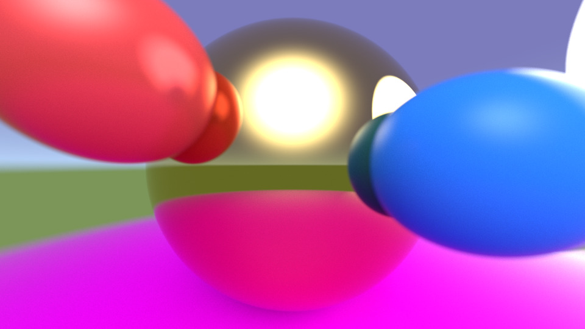

Computer Vector Graphics Math Library
=====================================

> Because reinventing the wheel is half the fun.

  
*A path tracing scene using `cvmath`. See [pathtracing.rs](examples/pathtracing/main.rs).*

🔍 What is this?
---------------

`cvmath` is a lightweight, graphics-oriented math library written in Rust. It focuses on **vector math and geometric primitives** commonly used in computer graphics. It is not a general-purpose numerical library.

If you're building 2D/3D renderers, ray tracers, or similar tools and want something compact and to the point, this might be a good fit.

The API is lean, clear, and practical.

✨ Features Overview
--------------------

All types are available at the crate root.

### General Types

- `Vec2<T>`, `Vec3<T>`, `Vec4<T>` — 2D, 3D, and 4D vectors
- `Bool2`, `Bool3`, `Bool4` — Boolean vector masks
- `Angle<T>` — Angles in radians
- `Complex<T>`, `Polar<T>`, `Quat<T>` — Complex numbers, polar coordinates, and quaternions

### Matrices and Transformations

- `Mat2<T>`, `Mat3<T>`, `Mat4<T>` — General-purpose matrices
- `Transform2<T>`, `Transform3<T>` — Affine transformations

### Shapes and Geometry

Shapes are available in 2D and 3D variants.

- `Point2<T>`, `Point3<T>` — 2D and 3D points
- `Bounds2<T>`, `Bounds3<T>` — Axis-aligned bounding boxes
- `Plane2<T>`, `Plane3<T>` — Infinite planes
- `Circle<T>`, `Sphere<T>` — Defined by a center point and radius
- `Line2<T>`, `Line3<T>` — Line segments defined by two points
- `Triangle2<T>`, `Triangle3<T>` — Triangles defined by three points
- `Shape2<T>`, `Shape3<T>` — Generic shape enums for flexible composition

### Ray Tracing

Types involved in ray casting and intersection:

- `Ray2<T>`, `Ray3<T>` — Rays defined by origin, direction, and max distance
- `Hit2<T>`, `Hit3<T>` — Intersection results (distance, normal, index)
- `Trace2<T>`, `Trace3<T>` — Traits for types that support ray tracing

🔓 License
----------

Licensed under the [MIT License](https://opensource.org/licenses/MIT), see [license.txt](license.txt) for details.

### Contribution

Unless you explicitly state otherwise, any contribution intentionally submitted
for inclusion in the work by you, shall be licensed as above, without any additional terms or conditions.
